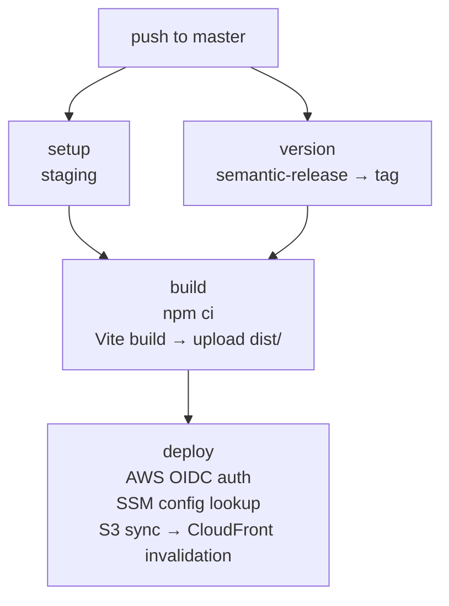
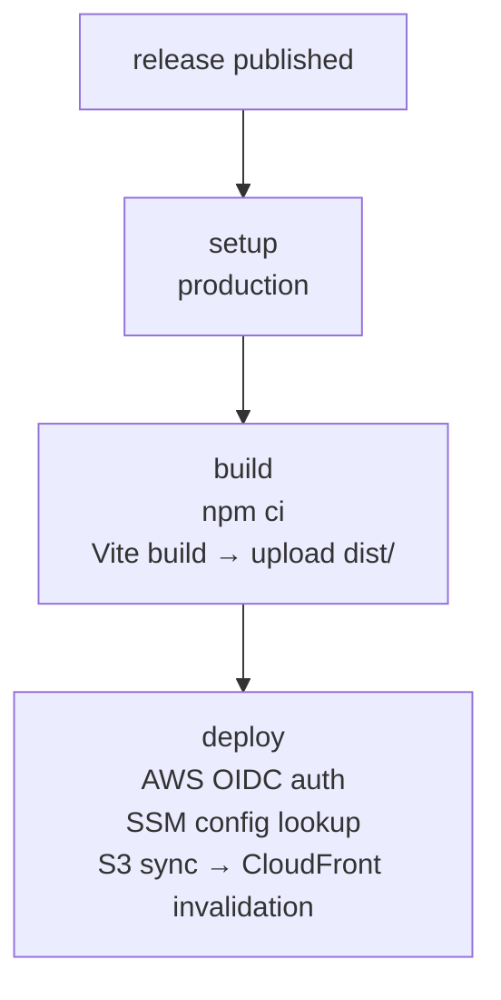

# hyoaru.github.io

Personal portfolio website showcasing developer profile, career history, certifications, technologies, GitHub activity, and Last.fm listening history. Built with React 19, TypeScript, and Vite.

## Architecture

The codebase follows clean architecture (hexagonal) with domain, application, and infrastructure layers under `src/`. Domain entities and use cases are framework-free. Infrastructure adapters handle GitHub API, Last.fm API, form submission, routing, state management, and UI rendering with HeroUI components.

Decorator patterns wrap adapters with logging and error handling. TanStack Query provides server state caching. TanStack Router handles file-based routing with code splitting. A manual dependency injection container wires everything together in `container.ts`.

### Platform Architecture


## Project Structure

```
hyoaru.github.io/
├── src/
│   ├── domain/                  # Entities & value objects
│   ├── application/             # Use cases & port interfaces
│   └── infrastructure/          # Adapters, components, hooks, router, container
├── .env.example                 # Required environment variables
├── vite.config.ts               # Vite + plugins
├── tsconfig.json                # TypeScript config
└── package.json
```

## Environment Variables

| Variable               | Description                           |
| ---------------------- | ------------------------------------- |
| `VITE_LAST_FM_API_KEY` | Last.fm API key for listening history |

## Deployment

### CI/CD Pipeline

Deployments are fully automated via GitHub Actions. All pipelines use OIDC-based AWS authentication, fetch configuration from SSM Parameter Store, and deploy to S3 with CloudFront invalidation.

#### Staging — `release.yml`

Triggered on push to `master`. Runs semantic-release to determine the next version, builds the Vite production bundle, and deploys to the staging CloudFront distribution.



#### Production — `publish.yml`

Triggered when a GitHub release is published. Builds from the release tag and deploys to the production CloudFront distribution.


